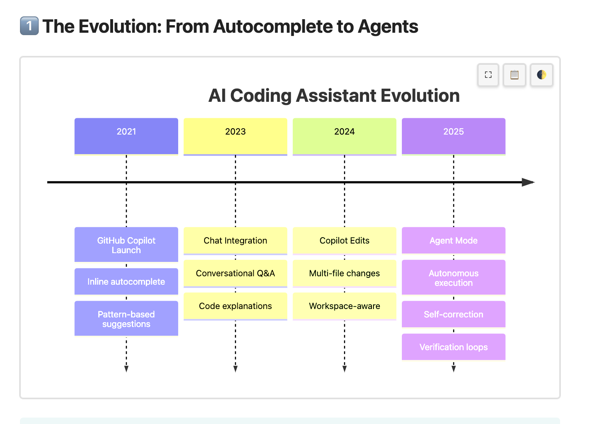
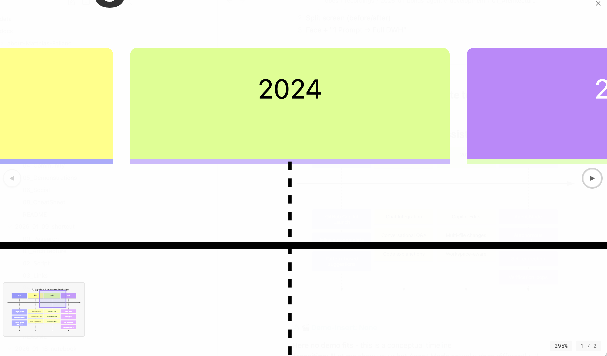
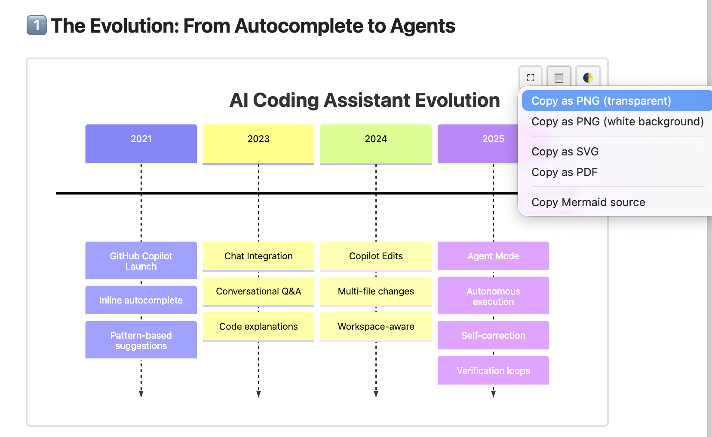
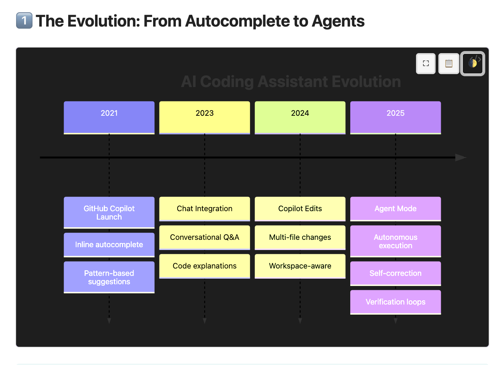

# Mermaid Maestro

All-in-one Mermaid enhancement plugin for [Obsidian](https://obsidian.md). Combines auto-fit, interactive lightbox, export capabilities, and context menu actions in a single plugin.



## Features

### Auto-Fit
Mermaid diagrams are automatically scaled to fit the container width using SVG viewBox manipulation — diagrams stay crisp at every zoom level.

### Lightbox (Click to Expand)
Click any diagram to open it in a large modal overlay:
- **Mouse wheel zoom** (centered on cursor position)
- **Drag to pan**
- **Minimap** appears when zoomed in, showing your current viewport
- **Keyboard shortcuts**: `+`/`-` zoom, arrow keys pan, `R` reset, `Escape` close
- **Touch support**: pinch-to-zoom and single-finger pan
- **Zoom indicator** shows current zoom percentage
- Theme-aware background (adapts to dark/light mode)



### Context Menu (Right-Click)
Right-click any diagram for export options:
- **Copy as PNG** (transparent or white background)
- **Copy as SVG** (clean markup with inline styles)
- **Copy as PDF** (clipboard on macOS, file download on other platforms)
- **Copy Mermaid source** (raw diagram code)



### Hover Toolbar
A small toolbar appears when hovering over a diagram with quick-access buttons for:
- Open in lightbox
- Export options
- **Theme toggle** — cycle between default, light, and dark background to improve readability of diagrams that don't match your current Obsidian theme



### Drag & Drop Export
Drag any diagram directly into other applications as a PNG image.

### Mermaid Engine Configuration
Configure Obsidian's built-in Mermaid.js engine directly from the plugin settings:

- **ELK Layout Engine** — Enable the ELK layout engine for dramatically improved layouts of complex diagrams. Use `flowchart-elk` or add `config: layout: elk` to your diagrams.
- **Max Edges Override** — Increase the default 500-edge limit for large architecture diagrams.
- **Global Theme** — Set a default Mermaid theme (default, dark, forest, neutral, base) for all diagrams. Individual diagrams can still override with `%%{init: {'theme': '...'}}%%` directives.
- **Version Detection** — Displays the Mermaid.js version bundled with your Obsidian installation.

### Additional Features
- Configurable PNG export resolution (1x, 2x, 3x, 4x)
- Mobile support with always-visible toolbar
- Works in both Reading View and Live Preview
- Per-feature toggle in settings
- No external network requests
- SVG sanitization for security (strips scripts and event handlers)

## Installation

### From Community Plugins (recommended)
1. Open Obsidian Settings
2. Go to Community Plugins and disable Restricted Mode
3. Click Browse and search for "Mermaid Maestro"
4. Install and enable the plugin

### Manual Installation
1. Download `main.js`, `elk-layout.js`, `manifest.json`, and `styles.css` from the [latest release](../../releases/latest)
2. Create a folder `mermaid-maestro` in your vault's `.obsidian/plugins/` directory
3. Copy the downloaded files into that folder
4. Restart Obsidian and enable the plugin in Settings → Community Plugins

## Settings

| Setting | Default | Description |
|---------|---------|-------------|
| Auto-Fit | On | Automatically scale diagrams to container width |
| Lightbox | On | Click to open diagrams in large overlay |
| Context Menu | On | Right-click export menu |
| Hover Toolbar | On | Show toolbar on diagram hover |
| PNG Export Scale | 2x | Resolution multiplier for PNG export |
| ELK Layout Engine | Off | Enable ELK for improved complex diagram layouts |
| Max Edges | 500 | Maximum edges allowed per diagram |
| Default Theme | default | Global Mermaid theme for all diagrams |

## Development

```bash
# Install dependencies
npm install

# Development build (watches for changes)
npm run dev

# Production build
npm run build
```

## License

[MIT](LICENSE)
